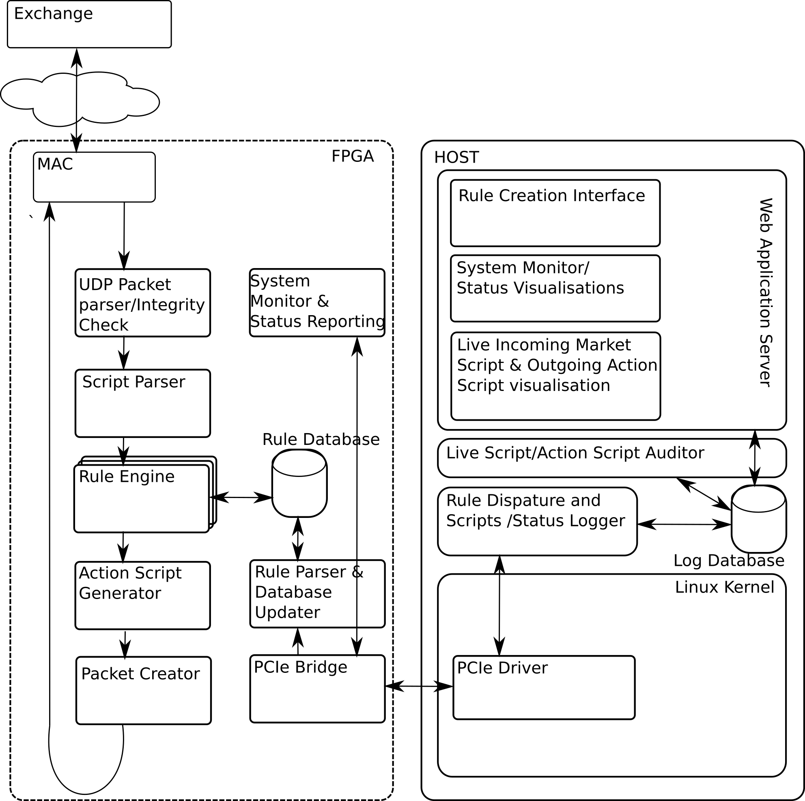
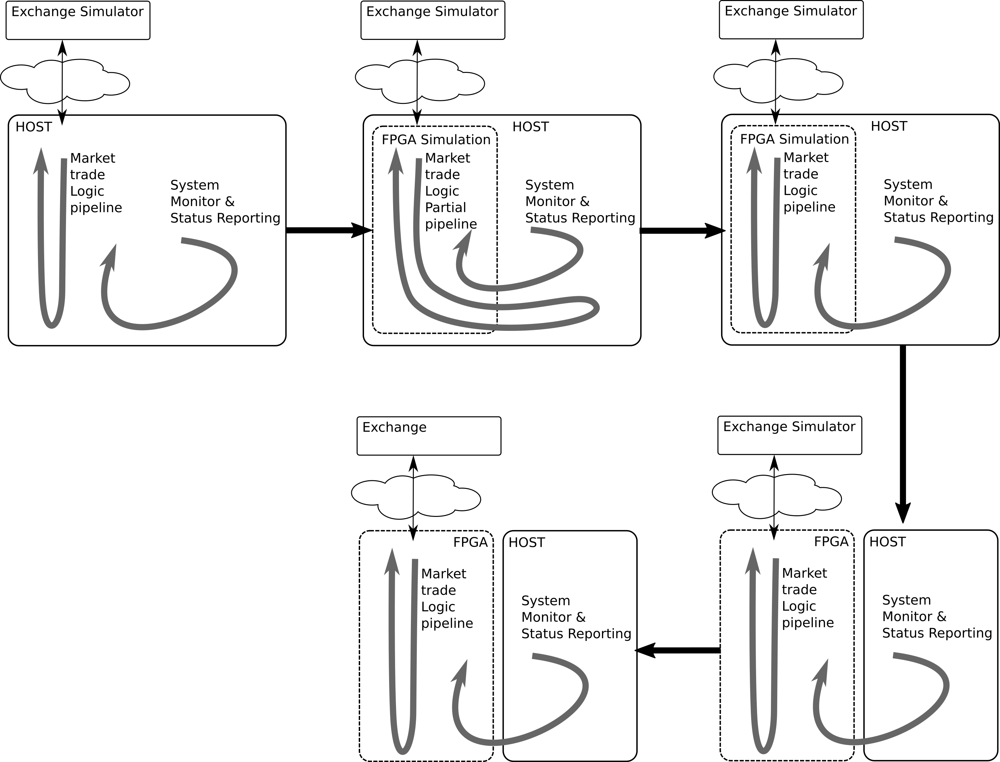

# FPGA based HFT Accelerator (Proposal)

**Abstract:** *High-frequency trading (HFT) has been in a limelight during the past couple of years, turning into an increasingly important component of financial markets. HFT is all about the speed: faster the algorithm analyse stock exchanges and execute trade orders, higher is the profit. Here I am proposing an abstract architecture and design flow for such Low-latency strategies pipeline design*

## High Frequency Trading Pipeline (Low-latency strategies)

Institutions are in a technological race to make market trade pipeline with as low latency as possible. A typical pipeline may be visualised like this 

|  | 
|:--:| 
| *High Frequency Trading Pipeline* |

In order to minimise the latency people started pushing certain compute intensive modules to FPGAs (Hybrid Design) 

| {:height="50%" width="50%"} | 
|:--:| 
| *Partial Low Latency Pipeline* |

It would be interesting to see an Ultra Low latency pipeline completely implemented in FPGA. Based on the market study and interaction with the peoples I have envision an architecture for such pipeline.

| {:height="50%" width="50%"} | 
|:--:| 
| *Ultra Low Latency Pipeline* |

## Architecture

The design is based on following considerations:

### FPGA
* Ultra Low latency pipeline completely implemented in FPGA
* Mechanism for dynamic Rule configuration
* Mechanism for Market trade pipeline on-line audit
* Mechanism for Status logging and error reporting

### Host
* Web-based trade rule creation interface
* Market trade pipeline activity visualisation
* System status/error visualisation

|  | 
|:--:| 
| *High Frequency Trading Architecture* |

## Development Methodology
Development Methodology is very important for such pipeline application. HFT pipeline requires extensive test benches and fast nightly updates. MyHDL, python based HDL library, being a high level language enables to write extensive unit tests and do development in agile methodology. Being a python based development environment it is also possible to do the simulation (functional testing) with the live network market simulators. Thus allowing extensive testing of the code. Further it also enables a smooth transition from host based HFT pipeline to FPGA based ultra low latency pipeline.

|  | 
|:--:| 
| *Smooth Design Flow* |
